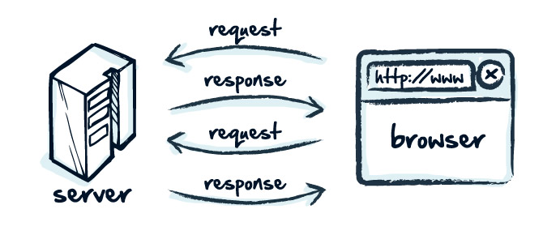

# 第二节

## 一个最简单的web 应用程序 -> hello.py

## 练习: -> dynamic_routes.py
- 访问/username/fujian, 返回Hello World, fujian!
- [参考文档](http://flask.pocoo.org/docs/0.12/quickstart/#variable-rules)

## 问题:
- app.route('/index') VS app.route('/index/') ?

## Response - Request Cycle

### 请求：request -> request.py
- 获取request中的headers信息, 参数信息
- app context (current_app, g), request context(request, session), [理解context](http://kronosapiens.github.io/blog/2014/08/14/understanding-contexts-in-flask.html)
- 路由: url_map

### 响应: response -> response.py
- response code: 1xx, 2xx, 3xx, 4xx, 5xx
- make_response
- abort, redirect

### [插件化](http://flask.pocoo.org/extensions/)：
- [flask script](https://flask-script.readthedocs.io/en/latest/) 在flask 0.11后已经加入了自己的[command line interface](http://flask.pocoo.org/docs/0.12/cli/)
- [flask-debugtoolbar](https://flask-debugtoolbar.readthedocs.io/en/latest/#)
