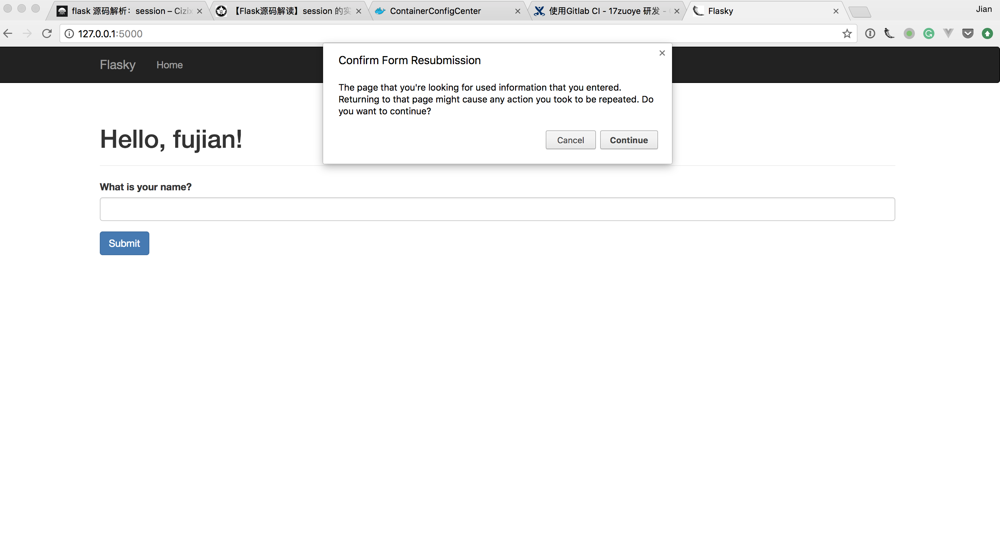

# 第四节 表单

## 问题：
1. 前端与后端有哪些数据的传递方式？
2. 优缺点是什么？

## 表单模块: WTForms
- [文档](https://wtforms.readthedocs.io/en/stable/)
- [Flask-WTForms](https://flask-wtf.readthedocs.io/en/stable/)
- **Quickstart**:
    - Form
    - Field
    - Validator
    - [Cross Site Request Forgery](https://www.hacksplaining.com/exercises/csrf#)

## 我的form长的太丑了，我想用bootstrap定制好看的form？怎么办？4a

- GET vs POST
- 如果想自己定制怎么办?
- 表单处理流程： - forms
    1. 定义数据
    2. 验证数据
    3. 使用数据

## 一个特别诡异的提示信息，99%的人都看过但是不知道怎么回事？

- PostRedirectGet Pattern

## 问题又来了，我的页面功能不完整了？4b

- 淘宝的购物车怎么实现的？
- 浏览器怎么记住你的登陆状态的？

## Message Flashing 4c

- [需要很好的用户交互](https://getbootstrap.com/docs/3.3/components/#alerts)
- flash, get_flashed_messages
- category
