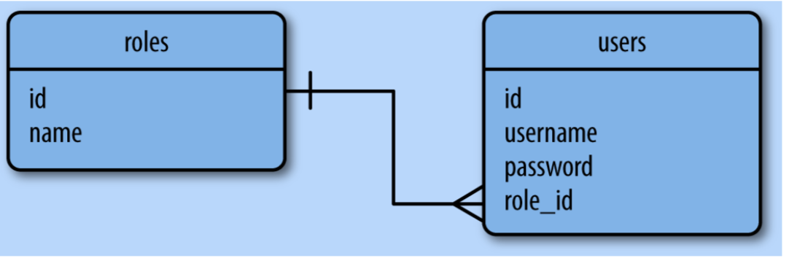

# 第五节 数据库

## 问题：怎么选择数据库？NoSQL vs SQL? 

### NoSQL:
- Queries SQL: 
  1. aql
  2. MapReduce: map-shuffle-reduce 
- Entity Group - Multi-row transaction
- Consistency - no master
- Scalability - sharding, load balance
- Management - No schema definition first
- Schemaless

### SQL
- Queries +
  1. Aggregation
  2. Join
- Transactions +
- Consistency
- Scalability - join?
- Management - add schema first
- Schema - [schema change](https://www.percona.com/doc/percona-toolkit/LATEST/pt-online-schema-change.html)

### 这些系统应该选择什么样的数据库进行存储？
1. 订单系统: 角色，客户，产品，订单？
2. 实时分析系统？
3. 内容管理系统?
4. 支付系统？
5. 标签系统？
6. RPG游戏中的角色？
7. 文件分享系统，dropbox ？
8. 用户系统？

[Google I/O 2012 - SQL vs NoSQL: Battle of the Backends](https://www.youtube.com/watch?v=rRoy6I4gKWU)

## PyMongo or Mongoengine? mysqlclient or SqlAlchemy?

1. Ease of use
2. Performance
3. Portability

## Flask-SQLAlchemy

[flask-sqlalchemy 文档](http://flask-sqlalchemy.pocoo.org/2.3/)

## 怎么使用FLASK_SQLALCHEMY?

1. [配置](http://flask-sqlalchemy.pocoo.org/2.3/config/)
2. 定义模型, UML
    - 
    - [Field definition](http://flask-sqlalchemy.pocoo.org/2.3/models/)
    - primary_key, unique, index, nullable, default
    - relationship: -> 5a
        1. 1对多
        2. 1对1 -> uselist=False
        3. 多对多
3. 数据库的操作
    - 创建表
    - CUD
    - R

## 怎么在View中使用DB操作 -> 5b

## 巧用 python shell -> 5c

## 如果数据库结构改变怎么办？ -> 5d

- Migration
